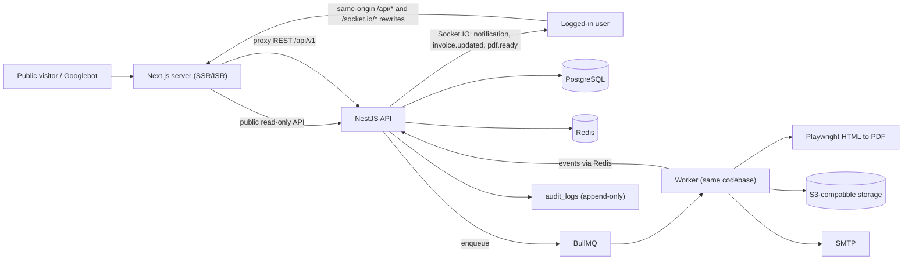

# Architecture

Multi-tenant invoicing platform: **Master Admin -> Company (tenant) -> Services/Brands -> Departments -> Users -> Business data**.

| Layer | Tech |
|---|---|
| Frontend | Next.js 15 (App Router), TypeScript, Tailwind, TanStack Query, React Hook Form, Zod, Socket.IO client |
| Backend | NestJS 11, Prisma, PostgreSQL 16+ |
| Async | Redis + BullMQ (PDF rendering, email, hourly overdue sweep) |
| Realtime | Socket.IO gateway with the Redis adapter (works across API replicas) |
| Email | Nodemailer over SMTP (Mailpit locally) |
| Files | Any S3-compatible store (RustFS locally, S3/R2 in production) |
| PDF | Playwright Chromium, HTML -> PDF |

## System diagram



## Principles

- **Modular monolith.** One NestJS app, one module per business area, two entrypoints: `main.ts` (HTTP + Socket.IO) and `worker.ts` (queues).
- **Backend is the source of truth.** Permissions, tenant scope, plan limits, totals, balances, numbering and invoice status are computed server-side only.
- **Next.js has no business logic.** Public pages are Server Components (SEO). `/admin` and `/app` are client components calling NestJS through the `/api` rewrite.
- **Money is `Decimal(18,2)`** in Postgres and `Prisma.Decimal` in code. Never JS floats.
- **Every sensitive action is audited**, including Master Admin actions. The audit table is append-only (enforced by a database trigger).

## Request pipeline

`requestContext (X-Request-Id + access log) -> Helmet -> CORS -> ThrottlerGuard -> AccessGuard -> ValidationPipe -> Controller -> Service -> Prisma`

`AccessGuard` (`src/tenancy/access.guard.ts`) is the single global guard. In order it checks: `@Public()` routes, the bearer token, `@MasterAdminOnly()` routes, the company membership (`X-Company-Id`), the optional service scope (`X-Service-Id`), the `@RequirePermission()` permission, and the subscription (a lapsed trial or subscription makes every write return 402 `SUBSCRIPTION_REQUIRED` unless the route is `@ReadOnlyRoute()`). Details in [tenancy.md](tenancy.md).

The guard builds a `TenantContext` (`src/tenancy/tenant-context.ts`) that controllers receive with `@Tenant()` and pass explicitly to services. Every query filters by `t.companyId` and, for service-scoped data, `t.allowedServiceIds`. There is no implicit/ambient tenant state.

Errors always use one envelope: `{ statusCode, code, message, errors?, requestId }`.

## Folder structure

```
backend/
  prisma/          schema.prisma, migrations/, seed.ts
  src/
    main.ts, worker.ts, app.module.ts, worker.module.ts, configure-app.ts
    config/        env validation (zod)
    common/        decorators, permissions, pagination, money, dates, plan limits, uploads, error filter
    infra/         prisma, storage (S3), queues, mail + templates, realtime (Socket.IO + Redis adapter)
    tenancy/       AccessGuard + TenantContext
    modules/       admin, audit, auth, company, dashboard, documents, invitations,
                   invoice-templates, invoices, notifications, parties (customers, vendors,
                   products, employees, departments, custom fields), payments, pdf,
                   public, reports, services, signup, users (members, roles)
  test/            e2e (supertest, separate database)
frontend/
  src/
    middleware.ts
    app/           (marketing) (auth) admin/ app/ b/[companySlug]/[serviceSlug] api/revalidate
    components/    ui/ (design system), data.tsx (list pages), marketing/
    features/      one folder per business area (invoices, services, templates, notifications, ...)
    lib/           api client, session, realtime, seo, utils
  e2e/             Playwright
docs/
docker-compose.yml
```

See [erd.md](erd.md), [tenancy.md](tenancy.md), [data-model.md](data-model.md), [template-schema.md](template-schema.md), [api.md](api.md), [deployment.md](deployment.md).

## Future modules

WhatsApp/Zoho/Yanolja integrations and AI automation would get their own module folders (see `backend/src/modules/_future/README.md`).
