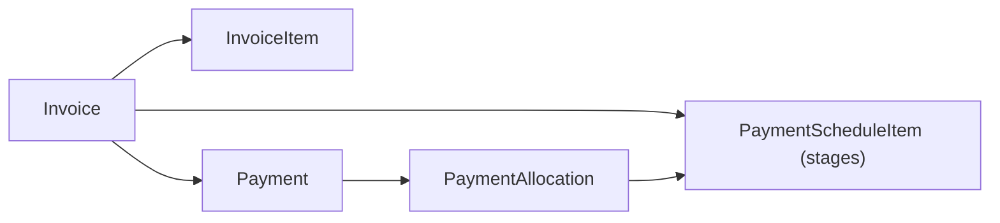

# Invoice and Payment Data Model

## Invoice

- One table for all types: `invoiceType` = `SALES | TAX | PROFORMA | PURCHASE | CREDIT_NOTE | DEBIT_NOTE`.
- `direction` = `RECEIVABLE` (customer pays us) or `PAYABLE` (we pay vendor), derived from type (`PURCHASE` = payable). Credit/debit notes inherit the direction of `referenceInvoiceId`.
- Exactly one of `customerId` / `vendorId` is set (validated in service).
- Stored totals: `subtotal, discountTotal, taxTotal, total, paidAmount, balanceAmount` - all `Decimal(18,2)`, all computed by `invoice-calculator.ts` on the backend.
- `invoiceNumber` is assigned only on **issue**, from the brand's `code` and its numbering config for the document's series (`INVOICE`, `PROFORMA`, `CREDIT_NOTE`, `DEBIT_NOTE`, `PURCHASE`), e.g. `LSP/INV/2026-27/000001`. The next value comes from an atomic upsert on `invoice_sequences` inside the issuing transaction. Unique per company. See `modules/invoices/numbering.ts` and [api.md](api.md#numbering).
- `taxMode` is `INTRA_STATE` (CGST = half the tax rounded to the paisa, SGST = the remainder), `INTER_STATE` (IGST) or `NONE`. When omitted it is derived from the brand's and the party's state (same or unknown = intra-state). Per-line `cgst/sgst/igst` are stored on `invoice_items`.
- On issue the backend records `templateVersionId`, `brandingSnapshot` and `partySnapshot` for audit. Rendering (preview, PDF download, email, receipts) always uses the current brand, customer/vendor and the brand's default published template, so later edits show on every invoice; the party snapshot is only used if the customer/vendor was deleted. Items, amounts and numbers stay locked after issue.

## Status (derived, never set manually)

| Status | Rule |
|---|---|
| DRAFT | not issued |
| ISSUED (AR) / RECEIVED (AP) | issued, paid = 0 |
| PARTIALLY_PAID | 0 < paid < total |
| PAID | paid >= total |
| OVERDUE | unpaid stage past due date (hourly sweep + on read) |
| CANCELLED / VOID | explicit action, only when net paid = 0 |

`invoice-status.ts#deriveStatus` is the single implementation.

## Payment schedule

- `payment_schedule_items`: `stageNumber, description, amount, dueType (FIXED | OPTIONAL | NONE), dueDate?, paidAmount, status`.
- Sum of stage amounts must equal the invoice total (validated on save). No schedule means one implicit stage.
- One invoice stays one invoice regardless of number of stages.

## Payments

- `payments`: `amount, method (CASH | BANK_TRANSFER | UPI | CARD | CHEQUE | OTHER), reference, paidAt (date), status (SUCCESS | FAILED | REFUNDED | REVERSED)`.
- Successful payments get a `receiptNumber` from the brand's `RECEIPT` series (receivables) or `VOUCHER` series (payables), and a downloadable receipt/voucher PDF.
- `payment_allocations` split a payment across stages, oldest due first (or a specific stage if given).
- Validation: `amount > 0`; `amount <= balance` (overpayment rejected); invoice must be issued and not cancelled/void.
- Refund / reversal marks the payment, deletes its allocations effect, and recomputes totals + status in the same transaction.
- All of this runs in `prisma.$transaction` with `SELECT ... FOR UPDATE` on the invoice row.
