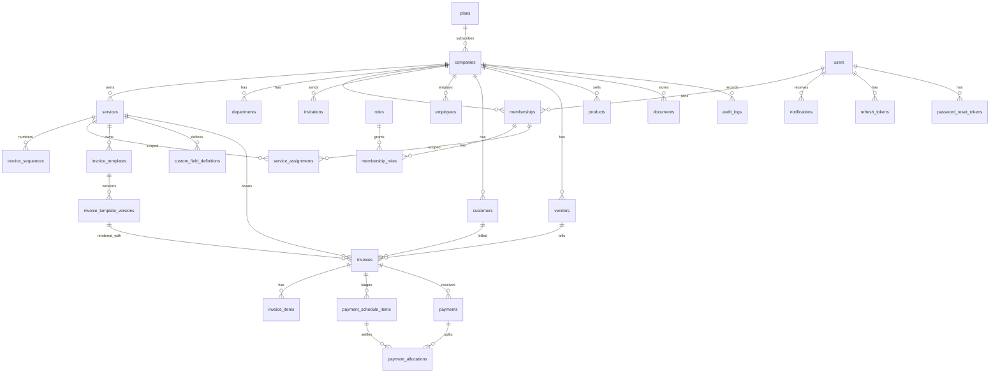

# Database ERD

Source of truth: [`backend/prisma/schema.prisma`](../backend/prisma/schema.prisma).

## Relationship rules

- **Identifiers**: every table's primary key is `id BIGSERIAL` (its own PostgreSQL sequence, `<table>_id_seq`); foreign keys are `BIGINT`. `invoice_sequences` and `service_assignments` use composite keys. Sequences leave gaps after rollbacks and deletes, and ids are never reused. The API validates ids with `common/ids.ts` and serialises them as JSON numbers, so they must stay within 2^53 − 1.

- **users** are global identities. They join companies through **memberships** (one person can work for several companies). `isMasterAdmin` is a platform flag.
- **plans** define `limits` (JSON validated by `common/plan-limits.ts`: max brands/users/customers/invoices per month, feature flags) and `trialDays`. A company's `subscriptionStatus` is `TRIALING`, `ACTIVE` or `EXPIRED`; a trial past `trialEndsAt` is treated as lapsed (read-only).
- **roles**: `companyId = null` means a system role (Company Admin, Service Admin, Employee); otherwise a company custom role. Permissions are stored as a string array of catalog keys (`invoice.issue`) on the role, validated against `backend/src/common/permissions.ts`.
- **membership_roles** optionally carry a `serviceId`, so a user can be Finance Manager in one service and Employee in another.
- **service_assignments** list which services a membership may access. Company Admins see all services.
- **invitations** carry the roles, services and department to grant on acceptance (`roleIds`, `serviceIds` arrays). They store only a SHA-256 hash of the emailed token, with an expiry, and are single-use (`acceptedAt` / `revokedAt`). **password_reset_tokens** and **refresh_tokens** are hashed the same way.
- **Tenant isolation**: every tenant-owned table has `company_id NOT NULL` + index. Service data also has `service_id`.
- **Customers/vendors** are company-level and shared across services. **Products** may be company-wide (`service_id = null`) or belong to one service. Invoices carry `service_id` for branding and numbering.
- **invoice_sequences** hold the next number per `(service, series, period)`; `period` is `""`, the year, or the financial year depending on the series' reset rule.
- The payment schedule is the set of `payment_schedule_items` of one invoice (the "schedule" is implicit, one per invoice).
- **notifications** belong to one user in one company (`readAt` null = unread).
- **Tenant-scoped uniques**: `(company_id, invoice_number)`, `(company_id, receipt_number)`, `(company_id, slug)` and `(company_id, code)` on services, `(template_id, version)`.
- **Indexes**: `(company_id, created_at)`, `(company_id, status)`, `(company_id, service_id)`, `customer_id`, `vendor_id`, `due_date`.
