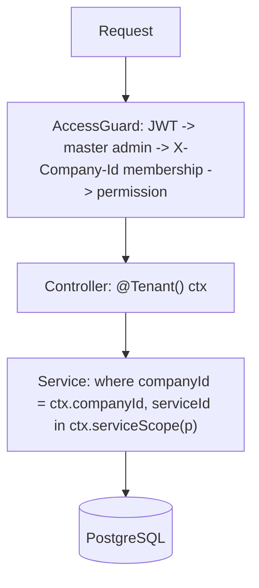

# Authentication and Multi-Tenant Authorization

## Authentication

- `POST /api/v1/auth/login`: argon2id password check. Returns a 15-minute access JWT (`sub` = user id) and sets a 7-day refresh token in an `httpOnly`, `SameSite=Lax` cookie scoped to `/api/v1/auth`.
- Refresh tokens are stored as SHA-256 hashes in `refresh_tokens`, grouped by `family`. Every refresh rotates the token. A token rotated less than 30 seconds ago may be presented again while its family still has a live token, so parallel tabs and retried requests don't sign the user out. Any other reuse of a revoked token revokes the entire family (theft detection). Logout, password changes and deactivation revoke the whole family immediately.
- The access token lives only in memory on the client. On page load the client calls `/auth/refresh` to get a new one.
- Next.js rewrites `/api/*` to NestJS, so the cookie is first-party. Because the refresh cookie is path-scoped, login also sets a non-secret `nv_session=1` flag cookie on `/`. `middleware.ts` only checks that flag *exists* to redirect anonymous users away from `/app` and `/admin`; it never authorizes.
- Login attempts are throttled and audited (`USER_LOGIN`, `USER_LOGIN_FAILED`).

## Tenant context

The JWT contains no company or permission data. Every tenant request sends `X-Company-Id` (and optionally `X-Service-Id`). A single global `AccessGuard` (`backend/src/tenancy/access.guard.ts`) runs on every request:

1. `@Public()` routes skip everything. Otherwise it verifies the access JWT and loads the user (must be ACTIVE) into `req.actor`.
2. `@MasterAdminOnly()` routes require `isMasterAdmin`.
3. Routes marked `@RequirePermission(p)` or `@TenantMember()` need a valid `X-Company-Id`. `TenantContextFactory` loads the user's active membership in that (ACTIVE) company, the permissions of its roles (company-wide vs. service-bound), and `allowedServiceIds` (all services for Company Admin, otherwise service assignments). An `X-Service-Id` outside that list is rejected.
4. The resulting `TenantContext` is attached to `req.tenant`, and the route fails with 403 unless the user holds `p` somewhere in the company.
5. Subscription: if the company's trial has ended or its subscription is `EXPIRED`, every non-GET permission route returns **402** `SUBSCRIPTION_REQUIRED` unless it is marked `@ReadOnlyRoute()`. `@TenantMember()` routes (context, notifications) and master admins are exempt.

Controllers receive the context explicitly with the `@Tenant()` parameter decorator and pass it to services. There is no ambient/global request state, so a service method cannot run tenant queries without being handed a context.

`TenantContext` exposes the per-service checks used in the service layer:

- `serviceScope(p)`: service IDs where the user holds `p`, narrowed by `X-Service-Id`. Used in list queries.
- `assertService(p, serviceId)`: 404 if the service is outside the user's scope (existence isn't leaked), 403 if it's visible but not permitted.
- `permissionsFor(serviceId?)`: what `GET /me/context` returns to the UI (union across services when no service is selected).

## Rules enforced in code

- Services always take `companyId` from the `TenantContext`, never from the request body/params.
- Lookups use `findFirst({ where: { id, companyId } })`; a record of another tenant returns **404** (existence is not leaked).
- IDs are sequential integers, so they are guessable by design: authorization never relies on an ID being secret. Neighbouring IDs of another company, or a guessed `X-Company-Id`/`X-Service-Id`, return 404 just like IDs that don't exist (`test/ids.e2e-spec.ts`). Links sent to people outside a session (invitations, password resets) carry random single-use tokens that are stored hashed, never record IDs. Public pages use slugs.
- Service-level data is filtered with `serviceId IN ctx.serviceScope(permission)`.
- `/api/v1/admin/*` routes are marked `@MasterAdminOnly()` and are audited.
- Permission catalog lives in `backend/src/common/permissions.ts`. The frontend reads `GET /me/context` only to show/hide UI.
- Future hardening: Postgres RLS on `company_id` (schema already supports it).
